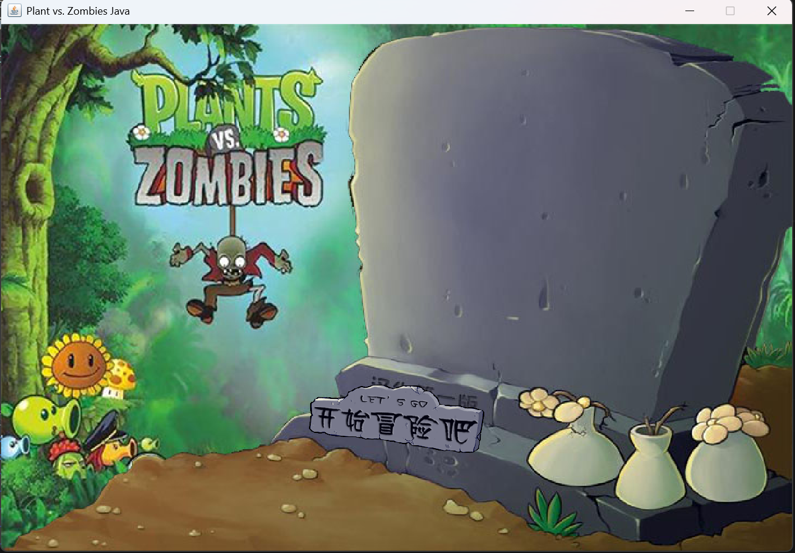
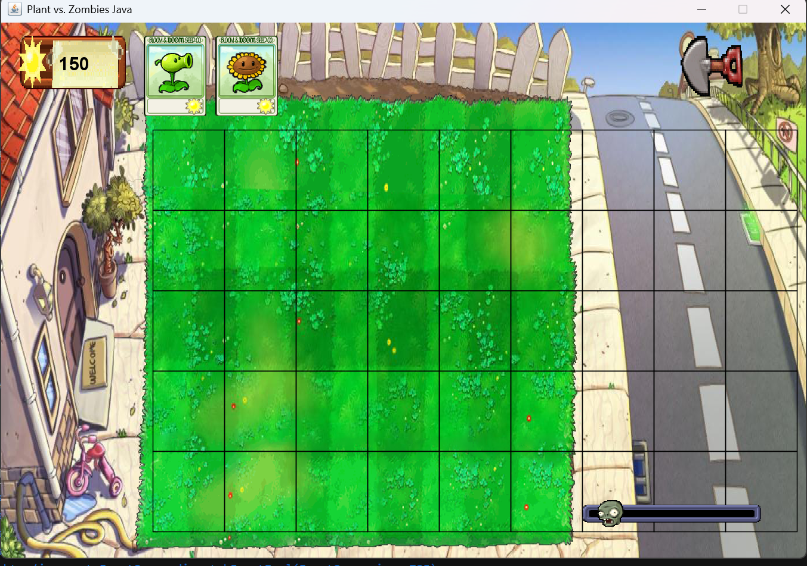
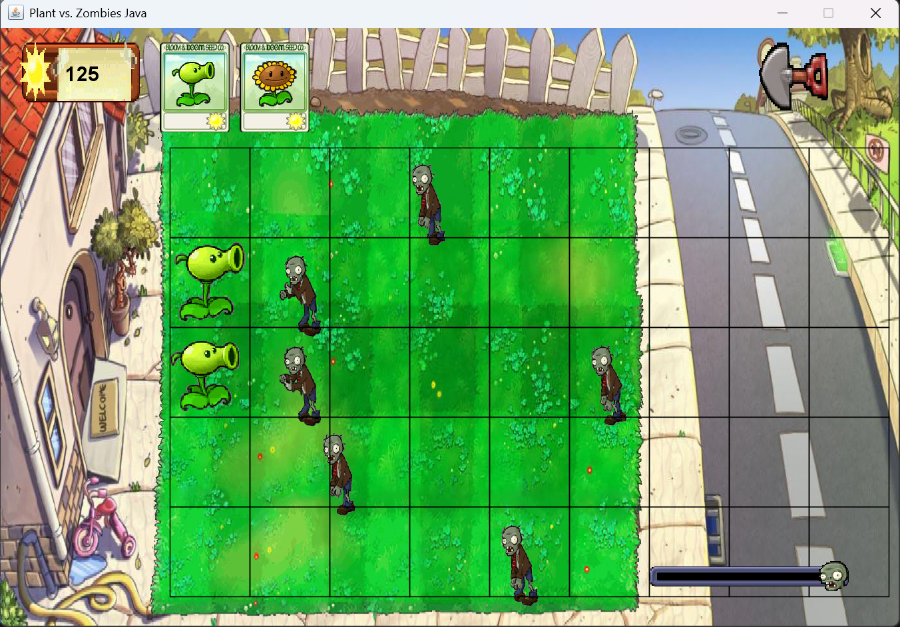

# Plants vs Zombies - Java 


一个基于 **Java Swing** 实现的植物大战僵尸 Demo 项目。

本项目是面向对象课程设计作业，目标是通过 Java 实现一个具有基本游戏流程、实体系统、资源管理、动画播放、关卡管理和存档功能的植物大战僵尸简化版 Demo。

> 本项目仅用于课程设计与学习交流，不用于商业用途。

---

## 项目简介

本项目模拟了植物大战僵尸的核心玩法：

- 玩家可以选择植物卡片
- 在草坪格子中种植植物
- 向日葵可以生产阳光
- 豌豆射手可以攻击僵尸
- 僵尸会从右侧出现并向左移动
- 僵尸碰到植物后会停下并攻击植物
- 子弹命中僵尸后造成伤害
- 支持暂停、胜利、失败、存档和读档等功能

目前项目定位为 **课程设计 Demo**，并非完整复刻原版植物大战僵尸。

---

## 已实现功能

### 基础游戏流程

- 主菜单场景
- 游戏关卡场景
- 胜利场景
- 失败场景
- 场景切换管理

### 植物系统

- 豌豆射手 Peashooter
- 向日葵 Sunflower
- 植物卡片选择
- 植物冷却机制
- 阳光消耗机制
- 铲子移除植物

### 僵尸系统

- 普通僵尸 NormalZombie
- 僵尸自动生成
- 僵尸移动
- 僵尸攻击植物
- 僵尸死亡判断

### 子弹系统

- 豌豆子弹 PeaBullet
- 子弹移动
- 子弹与僵尸碰撞检测
- 命中后造成伤害

### 阳光系统

- 当前阳光数量管理
- 向日葵生产阳光
- 天空自然掉落阳光
- 鼠标点击收集阳光
- 阳光 UI 显示

### UI 系统

- 植物卡片栏
- 阳光槽
- 暂停菜单
- 状态提示信息
- 铲子 UI
- 关卡进度条

### 资源系统

- 图片资源统一管理
- 音频资源统一管理
- 图片 key 映射
- 支持动画帧批量加载

### 动画系统

- Animation
- AnimationPlayer
- 植物动画
- 僵尸动画
- 阳光动画

### 存档系统

- 保存当前阳光数量
- 保存植物状态
- 保存僵尸状态
- 保存子弹状态
- 保存场上阳光
- 保存关卡进度
- 支持读档恢复游戏状态

---

## 技术栈

- Java
- Java Swing
- Java AWT
- 面向对象程序设计
- 游戏循环
- 资源管理
- 简单动画系统
- 碰撞检测
- Java 对象序列化存档

---

## 项目结构

```text
src/com/xhl/pvz
├── Main.java
│
├── app
│   ├── GameApp.java
│   ├── GameWindow.java
│   └── GamePanel.java
│
├── core
│   ├── GameConfig.java
│   ├── GameLoop.java
│   ├── SceneManager.java
│   └── LevelContext.java
│
├── scene
│   ├── Scene.java
│   ├── BaseScene.java
│   ├── MainMenuScene.java
│   ├── LevelScene.java
│   ├── GameOverScene.java
│   └── WinScene.java
│
├── animation
│   ├── Animation.java
│   ├── AnimationPlayer.java
│   └── AnimationState.java
│
├── entity
│   ├── Entity.java
│   ├── LivingEntity.java
│   │
│   ├── plant
│   │   ├── Plant.java
│   │   ├── Peashooter.java
│   │   └── Sunflower.java
│   │
│   ├── zombie
│   │   ├── Zombie.java
│   │   └── NormalZombie.java
│   │
│   ├── bullet
│   │   ├── Bullet.java
│   │   └── PeaBullet.java
│   │
│   └── item
│       ├── CollectableItem.java
│       └── Sun.java
│
├── factory
│   ├── PlantFactory.java
│   ├── ZombieFactory.java
│   ├── BulletFactory.java
│   └── PlantCardFactory.java
│
├── lawn
│   ├── Cell.java
│   ├── Grid.java
│   ├── Lane.java
│   └── Lawn.java
│
├── manager
│   ├── ImageManager.java
│   ├── AudioManager.java
│   ├── EntityManager.java
│   ├── CollisionManager.java
│   ├── LevelManager.java
│   ├── SaveManager.java
│   └── SkySunSpawner.java
│
├── model
│   └── SunResource.java
│
├── resource
│   └── ImageKeys.java
│
├── save
│   ├── SaveData.java
│   ├── PlantSaveData.java
│   ├── ZombieSaveData.java
│   ├── BulletSaveData.java
│   └── SunSaveData.java
│
└── ui
    ├── UIButton.java
    ├── PlantCard.java
    ├── CardBarUI.java
    ├── SunBankUI.java
    ├── PauseMenuUI.java
    ├── StatusMessageUI.java
    ├── ShovelUI.java
    └── LevelProgressUI.java
    
resources
├── images
│   ├── background
│   ├── ui
│   ├── cards
│   ├── plants
│   ├── zombies
│   ├── bullets
│   └── items
│
├── sounds
│   ├── bgm
│   └── effect
│
└── saves

## 现阶段游戏效果

### Overall


### 大厅界面



### 主游戏场景




### 死亡界面


~~ 目前 僵尸还是太强了，赢不了 ~~

## 下一阶段的目标

+ 登录系统
+ 账号管理
+ 采用jdbc,以接入pgsql
